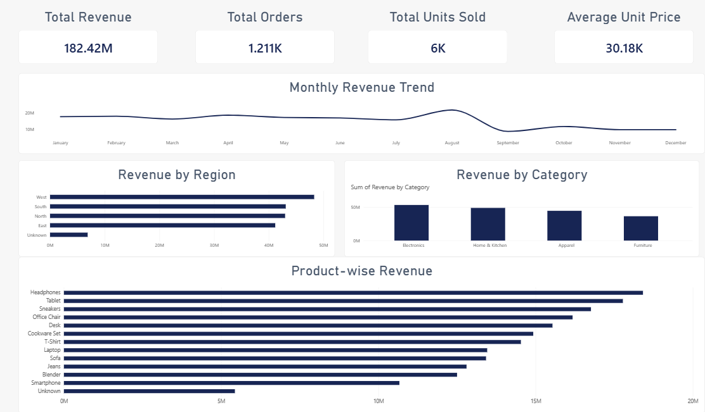

# 🧹 Data Cleaning & Reporting Automation

## 📌 Project Overview

This project focuses on cleaning, preprocessing, and analyzing a messy sales dataset using Microsoft Power BI.

The original dataset contained duplicate records, missing values, inconsistent region and category names, mixed date formats, inconsistent text values, and currency formatting issues.

The data was cleaned and transformed to create a reliable dataset for reporting and business analysis.

---

## 🎯 Project Objectives

- Clean and preprocess raw sales data
- Remove duplicate records
- Handle missing and invalid values
- Standardize region and category names
- Standardize product and salesperson information
- Clean customer email data
- Convert mixed date formats into a consistent format
- Convert currency and numeric fields into usable numerical values
- Build an interactive sales reporting dashboard
- Present meaningful business insights through visualizations

---

## 🧹 Data Cleaning Performed

The following preprocessing steps were performed:

- Removed duplicate records
- Standardized region values such as North, South, East, and West
- Corrected inconsistent category names
- Handled missing product and salesperson values
- Standardized customer email values
- Converted mixed date formats into a standard date format
- Removed currency symbols and commas from numerical fields
- Converted numerical columns to appropriate data types
- Added Year and Month fields for reporting

### Data Quality Improvement

| Metric | Value |
|---|---:|
| Original Records | 1,255 |
| Cleaned Records | 1,211 |
| Duplicate Records Removed | 44 |

---

## 📊 Dashboard Preview

---

## 📈 Dashboard Features

### 1. Total Revenue
Displays the total revenue generated from the cleaned sales dataset.

### 2. Total Orders
Shows the total number of sales orders available after data cleaning.

### 3. Total Units Sold
Displays the total quantity of products sold.

### 4. Average Unit Price
Shows the average selling price of products.

### 5. Monthly Revenue Trend
Visualizes revenue performance across different months to identify changes in sales trends.

### 6. Revenue by Region
Compares revenue generated across different regions.

### 7. Revenue by Category
Shows the revenue contribution of different product categories.

### 8. Product-wise Revenue
Compares revenue generated by individual products.

---

## 🛠️ Tools & Technologies

- Microsoft Power BI
- Power Query
- Data Cleaning & Transformation
- Data Visualization
- DAX
- CSV Dataset

---

## 🔍 Key Outcomes

- Improved data consistency by standardizing categorical and text values
- Removed duplicate records from the raw dataset
- Handled missing and invalid data values
- Converted inconsistent data formats into analysis-ready fields
- Created an interactive reporting dashboard
- Enabled easier analysis of revenue, products, categories, and regions

---

## 🚀 Conclusion

The project demonstrates how raw and inconsistent sales data can be transformed into a clean, structured dataset and converted into an interactive business intelligence report.

The final Power BI dashboard provides a clear view of sales performance and helps users analyze revenue trends, regional performance, category performance, and product-level performance.

---

## 👩‍💻 Author

**Gouri Mundada**

Data Analytics Project  
Built using Microsoft Power BI
